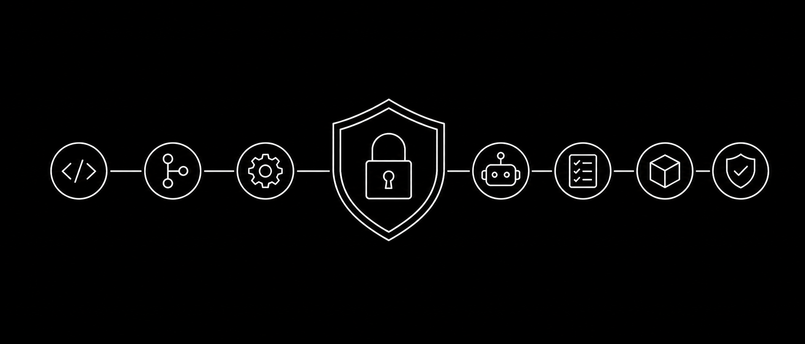

# Agentic CI/CD Security

<p align="center">
  
</p>

<p align="center">
  <strong>A practical security knowledge base and hardening framework for securing AI agents in CI/CD pipelines and autonomous software delivery workflows.</strong>
</p>

<p align="center">
  <a href="./LICENSE"></a>
  <a href="./CONTRIBUTING.md"></a>
  <a href="https://github.com/ememchijioke/Agentic-cicd-security/stargazers"></a>
  <a href="https://github.com/ememchijioke/Agentic-cicd-security/issues"></a>
</p>

---
## Why Agentic CI/CD Security?

AI coding agents are increasingly being integrated into pull request review, issue triage, code modification, documentation generation, testing, and release workflows.

These agents often process **untrusted repository or user-controlled input** while operating near **privileged CI/CD environments**.

That creates a new security boundary.

A malicious pull request, issue comment, markdown file, commit message, or configuration file may influence an AI agent that has access to repository tokens, workflow runners, secrets, shell tools, or deployment paths.

This repository maps those risks and documents practical engineering defenses for safer agentic software delivery.

---

## Table of Contents

- [Agentic CI/CD Security](#agentic-cicd-security)
  - [Why Agentic CI/CD Security?](#why-agentic-cicd-security)
  - [Table of Contents](#table-of-contents)
  - [Core Threat Model](#core-threat-model)
    - [Untrusted Context Flow](#untrusted-context-flow)
    - [Excessive Token Permissions](#excessive-token-permissions)
    - [Unsafe Tool Execution](#unsafe-tool-execution)
    - [Secret Exposure](#secret-exposure)
    - [Unsafe Output Handling](#unsafe-output-handling)
  - [Repository Structure](#repository-structure)
    - [Defensive Tools and Frameworks](#defensive-tools-and-frameworks)
    - [Standards and Security References](#standards-and-security-references)
    - [Contributing](#contributing)
    - [License](#license)
---

## Core Threat Model

AI agents operating within software delivery pipelines often read untrusted context while operating near privileged environments. Common untrusted inputs include:

- Pull request titles and descriptions
- Issue bodies and comments
- Commit messages
- Repository markdown files
- Configuration files
- Code comments
- External documentation
- Generated logs or artifacts

This creates several distinct risk areas:

### Untrusted Context Flow
Poisoned pull requests, malicious markdown, injected commit messages, or hostile documentation may attempt to manipulate agent behavior.

### Excessive Token Permissions
Agents may run with repository tokens that allow write access, pull request modification, issue comments, release creation, or workflow changes.

### Unsafe Tool Execution
Agents may execute shell commands, run package managers, call external tools, or modify files based on untrusted input.

### Secret Exposure
Environment variables, API keys, cloud credentials, package registry tokens, and deployment secrets may become visible to agent tools or logs.

### Unsafe Output Handling
Agent-generated patches, comments, workflow changes, or release steps may be trusted without sufficient human review.

---

## Repository Structure

.github/workflows/
  CI workflows for validating the repository itself.

assets/
  Images, banners, diagrams, and visual materials used in the project.

checklists/
  Actionable security checklists for reviewing agentic CI/CD workflows.

examples/
  Vulnerable and hardened workflow examples.

threat-models/
  Threat models for common AI-agent software delivery patterns.

resources/
  Curated tools, standards, papers, blog posts, and case studies.
```

### Defensive Tools and Frameworks
*   [mcp-context-protector](https://github.com/trailofbits/mcp-context-protector) — A Trail of Bits security wrapper enforcing prompt injection and context manipulation defenses directly at the tool server layer.
*   [Agentic Actions Auditor](https://github.com/trailofbits/skills/tree/main/plugins/agentic-actions-auditor) — Trail of Bits plugin designed to perform static security analysis on GitHub Actions workflows invoking AI coding agents (such as Claude Code or Gemini CLI) to identify injection paths.
*   [Defenter](https://github.com/example/defenter) — A semantic monitoring proxy designed to sit between CI runners and LLM providers to detect real-time context contamination.

### Standards and Security References
*   [OWASP Top 10 for Agentic Applications](https://owasp.org/www-project-mcp-top-10/) — The emerging baseline risk framework for agentic applications and systemic integrations.
*   [Model Context Protocol Specification](https://modelcontextprotocol.io) — Core openspec guidance outlining strict input validation and human-in-the-loop (HITL) baselines.


### Contributing
Contributions are welcome. Please keep submissions practical, security-focused, and clearly sourced where possible. Review CONTRIBUTING.md for formatting rules.
Useful contributions include:

* New checklist items
* Threat models
* Vulnerable workflow examples
* Hardened workflow examples
* Research papers
* Defensive tools
* Case studies
* Corrections to existing guidance
* Better explanations of attack patterns
* Safer CI/CD design patterns


See CONTRIBUTING.md for contribution guidelines.

### License
This project is licensed under the MIT License.